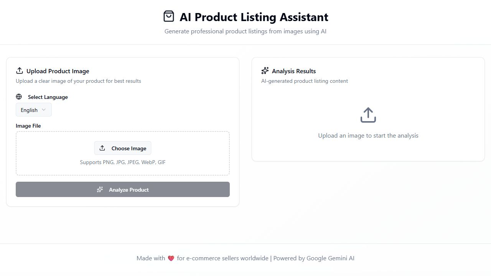

# AI Product Listing Assistant

Multimodal GenAI tool that turns product images into SEO-friendly product titles, descriptions, and tags. The project demonstrates image understanding, multilingual generation, FastAPI service design, and resilience patterns around AI API calls.

Live demo: https://ai-product-listing-assistant.vercel.app/

## Preview



## Role Fit

| Target role | Evidence shown in this repo |
| --- | --- |
| AI Engineer | Gemini Vision integration, structured output generation, API service layer |
| GenAI Engineer | Multimodal prompting, multilingual generation, response validation |
| Full-Stack / Backend | FastAPI backend, Streamlit UI, service layering, deployment-ready structure |
| Data Analyst / E-commerce Analyst | Product attribute extraction, listing metadata, tags, category/search optimization |

## AI Problem Solved

E-commerce sellers need consistent product listings, but writing titles, descriptions, and tags from images is slow and inconsistent. This app uses a vision-language model to inspect a product image and generate listing-ready content in multiple languages.

## Architecture

```text
Product image
  -> Streamlit upload UI
  -> FastAPI endpoint
  -> ProductAnalysisManager
  -> ResilientProductAnalysisService
  -> Gemini Vision prompt
  -> Structured title, description, tags
  -> UI result display / API response
```

## AI and Data Flow

- Accepts product image uploads from the web UI or API.
- Sends the image to Gemini with listing-specific instructions.
- Generates title, description, and search tags.
- Supports multilingual output for international storefronts.
- Wraps AI calls with retry/circuit-breaker patterns to reduce failure impact.
- Exposes API endpoints for integration with storefront, ERP, or catalog systems.

## Key Engineering Highlights

- FastAPI backend separated from Streamlit presentation layer.
- Service layer for Gemini integration.
- Manager layer for business logic and validation.
- Resilience layer with retry and circuit-breaker behavior.
- Structured logging and health endpoints.
- Unit, integration, and E2E test structure.
- Type hints and Pydantic-style API boundaries.

## Supported Outputs

| Output | Purpose |
| --- | --- |
| Product title | Short, SEO-friendly listing name |
| Description | Buyer-facing product copy |
| Tags | Search and marketplace discovery keywords |
| Language variants | Localized content generation |

## Tech Stack

| Layer | Tools |
| --- | --- |
| AI | Google Gemini 2.0 Flash Vision |
| Backend | Python, FastAPI, Uvicorn |
| Frontend | Streamlit |
| Resilience | Retry logic, circuit breaker pattern, structured logging |
| Testing | pytest, Playwright, mocked AI responses |
| Quality | Black, isort, Ruff, mypy-style type hints |

## Evaluation and Testing

Recommended AI evaluation cases:

| Case | Expected behavior |
| --- | --- |
| Clear product image | Accurate title, description, and tags |
| Ambiguous product | Conservative wording without hallucinated details |
| Thai output | Natural Thai listing copy and relevant tags |
| Low-quality image | Controlled error or cautious response |
| Repeated API failure | Circuit breaker prevents repeated cascading failures |

Run tests:

```bash
make test-all
# or
pytest tests/ -v
```

Run with coverage:

```bash
pytest tests/ -v --cov=. --cov-report=term-missing
```

## Local Setup

```bash
git clone https://github.com/Praciller/AI-Product-Listing-Assistant.git
cd AI-Product-Listing-Assistant
```

Install dependencies:

```bash
uv sync
```

Create `.env`:

```env
GOOGLE_API_KEY=your_google_ai_studio_key
```

Run backend:

```bash
uv run python main.py
```

Run frontend:

```bash
uv run streamlit run streamlit_app.py
```

Open:

- API: `http://localhost:8000`
- Streamlit UI: `http://localhost:8501`
- API docs: `http://localhost:8000/docs`

## Deployment

Deployment options:

- Streamlit Cloud for the UI.
- Railway, Render, Fly.io, or similar for the FastAPI backend.
- Vercel/other frontend hosting if the UI is adapted.

Production checklist:

- Configure `GOOGLE_API_KEY` as a secret.
- Set CORS origins for the deployed frontend.
- Add rate limiting for public endpoints.
- Keep sample prompts and AI outputs for regression testing.

## Why This Repo Matters

This repo is a strong GenAI Engineer signal because it moves beyond text chat: it uses image input, multilingual output, API design, error handling, and tests. It is also useful for AI Engineer and backend/full-stack roles because it shows how to wrap an LLM/VLM in a maintainable service.

## License

MIT
